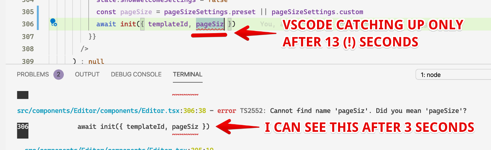

## 🐌 Addressing TypeScript slowness

We all know how **TypeScript can get slow in VSCode**. Ever found yourself waiting for the compiler to catch up with you as you type new code or fix errors?

This quickly gets frustrating, slowing down your feedback loops (and fast feedback loops are great to keep you happy and motivated!).

Here I'm sharing a simple tip that saved me hours of my life over the last 3 years working with TypeScript codebases (especially large ones!).

I wish I knew it earlier when I was just getting started with TypeScript…

## 🚀 How to fix slow TypeScript compilation

Here’s the trick:

1. Run a separate TypeScript process in watch mode in a terminal tab.
2. Keep it running as you write code — it’ll respond to changes and highlight errors a lot faster compared to VSCode.



In my experience, the difference can be striking (see the screenshot). It seems to depend on the project and npm libs it’s using, but the general pattern is pretty consistent across different projects and TS versions I worked with.

## Integrate with your TypeScript project

Here’s how to make it more convenient in your TypeScript project, step-by-step:

1. Add these 2 NPM scripts to your package.json:

```
"scripts": {
  ...
  "typecheck": "tsc",
  "typecheck:watch": "tsc -w"
  ...
}
```

2. Now run npm run `typecheck:watch` in a terminal tab (I like to do it in VSCode’s Terminal panel to keep things in the same window).

This starts a separate TypeScript process in the watch mode. It’ll take some time to start, but it’ll be much faster to re-compile your code incrementally as you change your code.

3. Use npm run typechek if only need to do the check once. It’ll run faster than the watch mode.
   I find it handy e.g. before deploying to make sure the build will be succesful.

## 🙌 That’s it!

I hope this tip helps you to have a faster TypeScript workflow and to be more efficient and happier when coding (it certainly helped me).

Please share your own experiences — did it help you to speed up your workflow?
