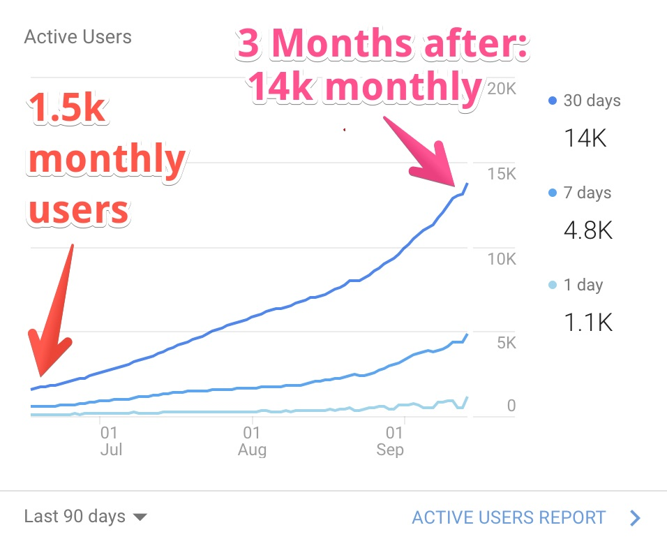
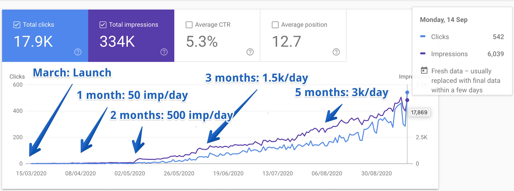
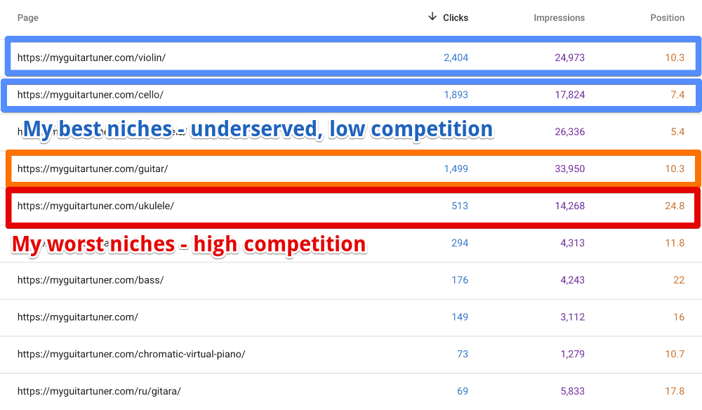

I launched [MyGuitarTuner](https://myguitartuner.com) over 6 months ago – a side project just for fun.

It's been visited by a large number of people, and it's still growing. I didn't promote it, just put it out there and played with SEO.

When a maker friend asked me what I did and if I could share any tips, I decided to write this article. I hope it'll help other makers with their launches and set the right expectations for SEO growth.

# Summary

> Disclaimer: I'm no SEO expert. I didn't know anything when I started, it's a naive dev's explorations in the world of SEO.

**Key take-aways for me were:**

- It took **really long for Google to index** and get first views (1-2 months)
- **Just putting the site out there and relying on SEO alone** can be **very slow**. Think months and years.
- Having **niche-specific pages** can be **very helpful for a few reasons**. More about it later.

# Getting first views can be slow

Here's the complete list of things I did when I launched it:

- added the website to search engines for indexing
- made sure the site has decent Lighthouse stats
- made sure the robots.txt and sitemap look good
- listed the app on AlternativeTo.com

That's it.

Unsurprisingly, it took a long time for search engines to start showing the site.

Since then, I didn't do anything to promote the app except for changing meta tags and text content and getting feedback from Google's Search console.

## How long it takes to gain momentum

Here's the complete history of SEO impressions and clicks, from the very beginning (click to enlarge):

# How niche-specific pages helped to grow

This simple idea helped to get most of the traffic:

**Having multiple landing pages, targeting different niches.**

For example, MyGuitarTuner supports multiple instruments: guitar, cello, ukulele, etc.

Instead of making it a one-page app, **I splitted the app into many separate pages, each having specific text content** for that instrument.

## Why it's a good thing to do?

- It **helped to find underserved niches with low competition**.

  E.g. there's myriads of guitar tuners out there (good luck competing with them!), but only a few tuners for violins or cellos.

  I didn't even know that violin tuners were a thing and people needed them!

  And yet most of my traffic comes from the violin and cello pages. Turns out there's an entire niche of music teachers who use them.

- It allowed for **multiple parallel experiments with meta-tags and text content, speeding up the painfully slow feedback loops.**

  E.g. when I found that one page did better then others in terms of click rate, I used wording of that page for other pages too.

  If I saw an improvement, it increased the probability that the new wording ranks better, more clickable (or both).

  Overall, I did around 15 changes/experiments with niche pages, optimizing their content, title and description tags.
  The feedback from the Goggle Search Console was delayed by a few days to a week.

## Niche pages stats

That's it! I hope it was helpful to get a better expectation for SEO indexing and growth timeline.

# About MyGuitarTuner

TLDR: ~~the most~~ an advanced online microphone tuner for musicians.

- it analyzes pitch of the played note in real-time (nothing new so far)
- but it does so with one of the best available algorithms, with a very fast Rust implementation running in a WebWorker
- ...and it has an interactive playable guitar neck
- ...and it's visual
- ...and...

You get the picture, it's a labor of a geek's passion.
